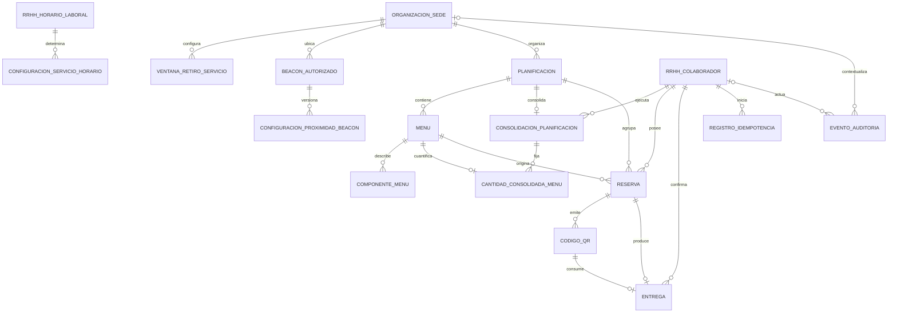

# ER físico v1 — módulo Alimentación

Fecha: 2026-09-04
Motor: Microsoft SQL Server 2017
Schema físico propuesto: **`[alimentacion]`**
Estado: propuesta DB pendiente del gate Review y de aprobación humana del schema.

## 1. Límites y fuentes

El modelo materializa únicamente planificación y menús, reservas, QR, entrega
presencial normal, configuración operativa, idempotencia y auditoría. No crea
usuarios, roles, inventario, compras, recetas, costos, capacidad, vistas,
triggers, procedures ni funciones.

Las únicas dependencias del núcleo son claves foráneas a:

- `organizacion.Sede(IdSede)` para sede operativa;
- `rrhh.Colaborador(IdColaborador)` para propietario y actores; y
- `rrhh.HorarioLaboral(IdHorarioLaboral)` para mapear el horario maestro a un
  servicio alimentario.

## 2. Diagrama

## 3. Inventario físico

| Grupo | Tabla | Propósito | Identidad / unicidad principal |
|---|---|---|---|
| Configuración | `ConfiguracionServicioHorario` | Mapea un horario central a desayuno, almuerzo o cena con vigencia. | Una configuración abierta por horario. |
| Configuración | `VentanaRetiroServicio` | Define la ventana por sede y servicio. | Una ventana abierta por sede y servicio. |
| Configuración | `BeaconAutorizado` | Registra UUID, major y minor sin secretos. | Identificador iBeacon único. |
| Configuración | `ConfiguracionProximidadBeacon` | Versiona muestreo, permanencia, salida y umbral RSSI. | Una configuración abierta por beacon. |
| Planificación | `Planificacion` | Agrupa los días elegidos por sede y controla la versión. | Una fila por planificación; no exige mes ni fechas consecutivas. |
| Planificación | `Menu` | Menú o marca excluyente de servicio no disponible. | Una fila por planificación, fecha y servicio. |
| Planificación | `ComponenteMenu` | Componentes informativos ordenados, no seleccionables. | Un orden por menú. |
| Consolidación | `ConsolidacionPlanificacion` | Hecho irreversible y actor de consolidación. | A lo sumo una consolidación por planificación. |
| Consolidación | `CantidadConsolidadaMenu` | Fotografía del total final por menú. | Una cantidad por consolidación y menú. |
| Reserva | `Reserva` | Asistencia individual con contexto de menú, sede y servicio. | Una reserva `RESERVADA` por colaborador y fecha. |
| QR | `CodigoQR` | Solo hash del valor opaco, vigencia máxima de cinco minutos y estado. | Un QR `VIGENTE` por reserva. |
| Entrega | `Entrega` | Retiro presencial normal confirmado. | Una entrega por reserva y por QR. |
| Técnica | `RegistroIdempotencia` | Huella de solicitud y resultado técnico acotado. | Clave UUID globalmente única. |
| Auditoría | `EventoAuditoria` | Evento minimizado y separado de logs técnicos. | Identificador de evento único. |

## 4. Estados y temporalidad

- Planificación: `BORRADOR`, `PUBLICADA_ABIERTA`, `PUBLICADA_CERRADA`,
  `CONSOLIDADA`; `VersionRegistro` soporta concurrencia optimista.
- Reserva: `RESERVADA`, `CANCELADA`, `ENTREGADA`, `NO_RECOGIDA`; las tres
  últimas son terminales según el contrato.
- QR: `VIGENTE`, `VENCIDO`, `UTILIZADO`, `REVOCADO`; el vencimiento es posterior
  a la emisión y no supera cinco minutos.
- Configuraciones: vigencias con extremo final abierto y fin posterior al inicio.
- El DDL usa `SYSUTCDATETIME()` como instante SQL autoritativo. La interpretación
  de negocio sigue `America/Lima`; no se recupera el corte histórico 23:59:59.

## 5. Invariantes declarativas

- `Menu.FechaServicio` es la fecha elegida para el servicio; puede pertenecer a
  cualquier mes y no exige consecutividad. La combinación planificación, fecha y
  tipo de servicio es única.
- Un menú disponible exige nombre; una combinación sin servicio no conserva
  contenido de menú.
- La reserva referencia de forma compuesta el menú, fecha, servicio,
  planificación y sede correctos.
- El índice filtrado de `Reserva` aplica la unicidad activa por colaborador y
  fecha entre todas las sedes y servicios.
- Un QR almacena hash, nunca el valor claro reutilizable, y los timestamps deben
  ser coherentes con su estado.
- `Entrega` referencia en forma compuesta el QR y la reserva propietaria.
- No se modelan cupos, capacidad, excepciones, archivos XLSX persistidos ni
  identidad paralela del colaborador.

## 6. Límites transaccionales

Las siguientes operaciones requieren una transacción futura del backend: crear
reserva y validar unicidad; cancelar; editar/copiar menú con versión; cerrar,
reabrir y consolidar; revocar y emitir QR; confirmar entrega cambiando Reserva a
`ENTREGADA` y QR a `UTILIZADO`; y anexar la auditoría asociada.

El alcance autorizado excluye triggers, procedures y permisos. Por ello el DDL
no puede demostrar por sí solo transiciones entre estados, inmutabilidad de una
planificación ya consolidada, ausencia de solapamientos históricos cerrados ni
carácter append-only frente a un principal con permisos directos. Esas garantías
deben revisarse con la implementación transaccional y el modelo de privilegios;
no se declaran satisfechas por evidencia estática.

## 7. Idempotencia

`RegistroIdempotencia` conserva UUID, actor, operación, hash de payload, estado,
resultado mínimo y expiración técnica. Reutilizar la misma clave con otro hash
debe producir conflicto; la coordinación atómica con el cambio funcional queda
en el límite transaccional del backend. `EventoAuditoria` almacena solo una
huella no reutilizable cuando corresponda, además de la correlación.

## 8. Reproducibilidad y reversión

- `db/aplicar_migraciones_gtm_alimentacion.sql` incluye las migraciones declaradas
  en orden (`001..012` y `017`) y
  permite construir núcleo + módulo desde una base vacía autorizada.
- `db/reversiones/revertir_alimentacion_completo.sql` exige confirmación, nombre
  exacto de base, rechazo de bases de sistema y huella de 15 tablas. Solo elimina
  objetos de `[alimentacion]` y nunca objetos del núcleo.
- Ningún archivo fue ejecutado o compilado contra SQL Server.
