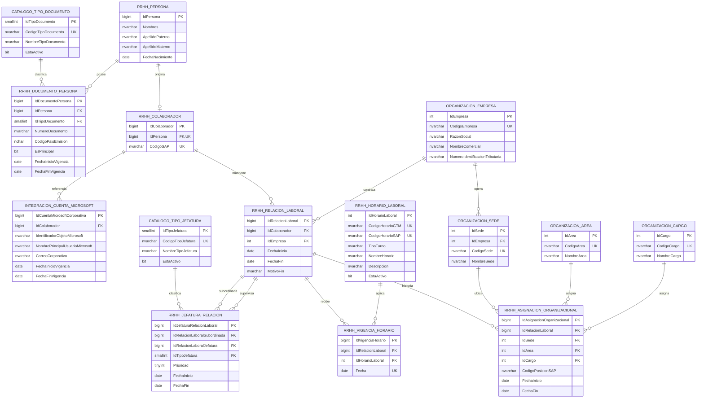

# Diagrama ER físico v1 — núcleo general GTM

## 1. Estado y alcance

Catálogo oficial de tablas del núcleo para Microsoft SQL Server 2017. No hay
evidencia de creación de una base, conexión a una instancia ni aplicación DDL.
Los únicos schemas propios son `catalogo`, `rrhh`, `organizacion` e
`integracion`.

No contiene entidades internas de Seguridad, Alimentación, Evaluaciones,
Marcaciones, Notificaciones o Declaraciones Juradas.

## 2. Modelo físico oficial

Los aliases Mermaid reemplazan el punto por guion bajo; los nombres SQL exactos
están en las migraciones y conservan la forma `[schema].[Objeto]`.

## 3. Convenciones físicas

- Claves sustitutas: `IDENTITY`; `BIGINT` para historia laboral e integración,
  `INT` para maestros organizacionales y horarios, `SMALLINT` para catálogos.
- Vigencias de relación, asignación y jefatura: intervalos semiabiertos
  `[FechaInicio, FechaFin)`; `NULL` representa un extremo abierto.
- `VigenciaHorario`: una asignación diaria identificada por `Fecha`, sin rango.
- Tiempo: fechas de negocio se resuelven con `SA Pacific Standard Time`, mapeo
  de SQL Server para la zona confirmada `America/Lima`; timestamps técnicos de
  creación/modificación se guardan en UTC.
- Texto: `NVARCHAR`; no se usa collation específico porque no fue confirmado.
- Integridad inicial: claves externas sin borrado en cascada, checks locales e
  índices filtrados para limitar a una fila con extremo abierto por contexto.
- Alcance: no existe `CREATE DATABASE`, `USE`, referencia de tres partes ni FK
  a otra base.

## 4. Invariantes materializadas

| Invariante | Mecanismo propuesto |
|---|---|
| Una Persona origina como máximo un Colaborador | `CU_Colaborador_Persona`. |
| Código de Colaborador obligatorio, no vacío y no duplicado | `NOT NULL`, `RV_Colaborador_CodigoNoVacio` y `CU_Colaborador_Codigo`; PM-01 aún define formato/generación. Estas restricciones no impiden actualizar el código ni garantizan su inmutabilidad. |
| Como máximo un documento principal abierto | índice filtrado `IN_DocumentoPersona_PrincipalAbierto`; PM-02/03 impiden exigirlo o declarar unicidad civil. |
| Como máximo una cuenta Microsoft con extremo abierto por Colaborador | Índice filtrado `IN_CuentaMicrosoftCorporativa_Abierta`. |
| Empresa explícita por relación laboral | FK obligatoria `RelacionLaboral.IdEmpresa`. |
| Como máximo una asignación con extremo abierto por relación | Índice filtrado `IN_AsignacionOrganizacional_Abierta`. |
| Una posición SAP abierta corresponde a una sola asignación | Índice filtrado `IN_AsignacionOrganizacional_PosicionSAPAbierta`; el código es obligatorio y no vacío. |
| Un horario por relación laboral y día | Índice único `IN_VigenciaHorario_RelacionFecha`; el mismo código puede repetirse en fechas distintas. |
| Dos prioridades posibles de jefatura y una fila abierta por prioridad | Check `Prioridad IN (1,2)` e índice filtrado correspondiente. |

## 5. Decisiones diferidas preservadas

- PM-01: el schema exige un código obligatorio, no vacío y único, pero no lo
  genera, no fija su formato ni impide su actualización. La estabilidad o
  inmutabilidad del código queda diferida a una fase con mecanismo aprobado.
- PM-02/03: no se declara una clave natural de Persona ni obligatoriedad de
  documento principal.
- PM-04/05: no se agrega estado derivado/administrado ni tabla Planilla.
- PM-06/07: Área y Cargo son maestros corporativos planos; su pertenencia y
  jerarquía no se anticipan.
- PM-08/09/10: se conservan `CodigoSAP` en `rrhh.Colaborador`,
  `CodigoPosicionSAP` en `rrhh.AsignacionOrganizacional` y
  `CodigoHorarioSAP` en `rrhh.HorarioLaboral`. Los tres son obligatorios; el
  código de colaborador y el de horario son únicos, y una posición SAP no puede
  estar abierta en más de una asignación. No se crean tablas SAP separadas ni
  se asume un mecanismo de sincronización.
- PM-11: el horario se asigna por día mediante un código y se clasifica como
  `MANANA`, `TARDE`, `NOCHE` o `MADRUGADA`. No se crean ciclos, calendarios ni
  excepciones adicionales.
- PM-12: no se prohíben jefaturas entre empresas ni se exige una principal. El
  máximo histórico de dos queda pendiente; solo se declaran prioridades 1 y 2 y
  una fila con extremo abierto por cada prioridad.
- PM-13: la asignación conserva una sede laboral; alcances adicionales siguen
  siendo responsabilidad de Seguridad externa.
- PM-14: se admite Object ID, UPN o correo y se exige al menos uno, sin declarar
  cuál es autoritativo.
- PM-15/16/17: no se agregan flujos de administración/importación, compatibilidad
  `PersonalSap.*`, auditoría funcional ni retención.

## 6. Invariantes pendientes de fase posterior

Sin vistas, disparadores ni procedimientos no pueden imponerse declarativamente
la contención entre vigencias de tablas distintas, la ausencia de solapamientos
históricos cerrados, la cobertura continua de asignación/horario durante toda
la relación, la pertenencia de la sede a la empresa de la relación ni el máximo
de dos jefaturas para cualquier fecha histórica. Esta entrega no declara esas
reglas satisfechas; deberán diseñarse y aprobarse en una fase futura.
