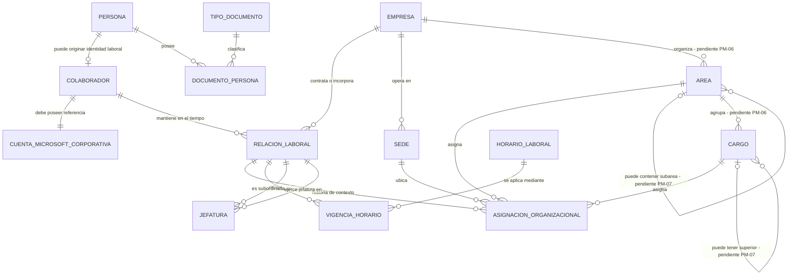
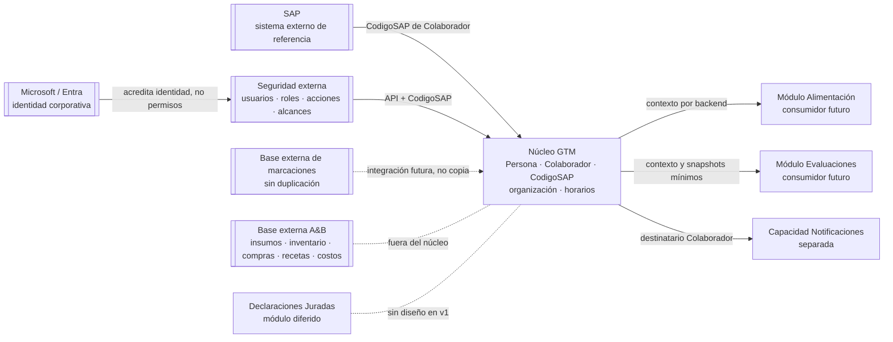

# Diagrama ER conceptual v1 — núcleo general de datos GTM

## 1. Propósito y lectura

Este modelo representa conceptos y cardinalidades del núcleo transversal. No es
un schema físico y no define tablas, columnas, tipos, claves, índices, schemas
SQL ni estrategia de migración.

`Persona` mantiene la identidad civil única; `Colaborador` mantiene la identidad
laboral estable de GTM; `RelacionLaboral` separa cada vínculo, reingreso o
planilla; y `AsignacionOrganizacional` conserva los cambios de contexto mediante
vigencias históricas.

Las relaciones marcadas con una pregunta material deben confirmarse en el
checkpoint antes de que un DB Agent proponga su materialización.

## 2. ER del núcleo

## 3. Semántica de las relaciones

| Relación | Regla conceptual |
|---|---|
| Persona–Colaborador | Una Persona puede no ser Colaborador; un Colaborador corresponde a una sola Persona. La posibilidad de más de un Colaborador por Persona no fue autorizada. |
| Colaborador–Relación laboral | Un Colaborador conserva cero o más relaciones históricas y puede tener varias activas simultáneamente. |
| Empresa–Relación laboral | Cada relación laboral pertenece a exactamente una Empresa. |
| Relación–Asignación | Una relación conserva varias asignaciones históricas; solo una puede estar vigente en un instante. |
| Asignación–Sede/Área/Cargo | Cada asignación resuelve exactamente uno de cada concepto. La pertenencia corporativa de Área y Cargo sigue pendiente. |
| Relación–Horario | Cada relación recibe un código de horario por fecha; el mismo código puede repetirse en cualquier cantidad de días y relaciones. |
| Relación–Jefatura | Cada ocurrencia de Jefatura vincula una relación subordinada con una relación supervisora; una subordinada admite hasta dos jefaturas vigentes. |
| Colaborador–SAP | `CodigoSAP` identifica al colaborador sin crear tablas de referencia SAP separadas. |
| Colaborador–Cuenta Microsoft corporativa | Todo Colaborador posee una cuenta corporativa básica. La referencia es obligatoria, externa y no equivale a usuario habilitado ni a permiso de aplicación. |

La notación `o{` permite historia vacía o múltiple. La relación `||--||` con la
cuenta Microsoft expresa obligatoriedad conceptual uno a uno; cuál identificador
es autoritativo y cómo se historiza continúa pendiente. Las demás
obligatoriedades al alta, los estados previos a contratación y los casos sin
documento requieren resolver las preguntas materiales antes del modelo físico.

## 4. Reglas temporales del modelo

1. Un reingreso crea otra `RELACION_LABORAL`; no altera la relación cerrada.
2. Dos planillas activas crean relaciones diferentes y mantienen asignaciones y
   horarios independientes.
3. Un cambio de cargo, área o sede cierra la vigencia de la
   asignación anterior y abre otra.
4. Cada día de una relación laboral registra una `VIGENCIA_HORARIO` con un código de horario; cambiar el código no altera los demás días.
5. Una jefatura conserva tipo, prioridad y vigencia; existen como máximo dos
   ocurrencias vigentes para una relación subordinada.
6. Los intervalos históricos no se sobrescriben. La resolución de solapamientos,
   límites inclusivos y correcciones retroactivas se define en la etapa DB.

## 5. Fronteras de dominio

Los nodos externos y consumidores de este diagrama de contexto no son entidades
del ER ni candidatos automáticos a tablas del núcleo.

## 6. Cobertura de dependencias modulares

| Consumidor | Necesidad del núcleo | Límite de esta versión |
|---|---|---|
| Alimentación | Colaborador estable, horario vigente por relación, sede y contexto autorizado. | No se modelan planificaciones, menús, reservas, QR, entregas ni configuración alimentaria. |
| Evaluaciones | Colaborador, cargo, área y relaciones de jefatura; datos mínimos para snapshot al publicar. | No se modelan formatos, períodos, preguntas, asignaciones de evaluación, respuestas ni PDFs. |
| Seguridad externa | Código estable de Colaborador y API para resolver contexto. | No se modelan usuarios, roles, permisos, sesiones, tokens ni menús. |
| Marcaciones/Asistencia | Identidad laboral que permita una futura conciliación. | No se copian marcaciones ni cálculos existentes. |
| Notificaciones | Colaborador como destinatario. | No se definen canales, plantillas, preferencias o tecnología de entrega. |

## 7. Invariantes conceptuales para aprobación

- Una Persona no se duplica por empresa, planilla, reingreso o código SAP.
- `CodigoSAP` es obligatorio y único en `Colaborador`.
- Todo Colaborador posee una cuenta Microsoft corporativa básica; tenerla no
  concede acceso, roles ni permisos en aplicaciones GTM.
- Cada relación laboral pertenece a una Empresa y mantiene contexto propio.
- Cada relación laboral tiene como máximo un código de horario registrado por
  fecha.
- Una relación subordinada no supera dos jefaturas vigentes.
- No se crean tablas separadas para centros de costo ni referencias SAP de
  empleado, posición o horario.
- Ninguna entidad representa seguridad interna, marcaciones copiadas o datos
  operativos A&B.

## 8. Decisiones pendientes que afectan el ER

Las preguntas PM-01 a PM-17 están enumeradas en `requirements.md`, sección 13.
Las de mayor impacto estructural directo son:

- PM-04: fuente del estado de Colaborador.
- PM-05: concepto Planilla y simultaneidad dentro de una misma Empresa.
- PM-06 y PM-07: alcance y jerarquía de Área/Cargo.
- PM-08 a PM-10: identidad, alcance y sincronización de referencias SAP.
- PM-11: no se modelan ciclos, calendarios ni excepciones; el código se asigna
  directamente por día.
- PM-12 y PM-13: reglas de jefatura y sedes autorizadas.
- PM-16: coexistencia o migración desde `PersonalSap.*`.

El checkpoint puede aprobar el modelo como base conceptual y diferir estas
decisiones con dueño y etapa explícitos; no deben convertirse en supuestos del
DB Agent.
