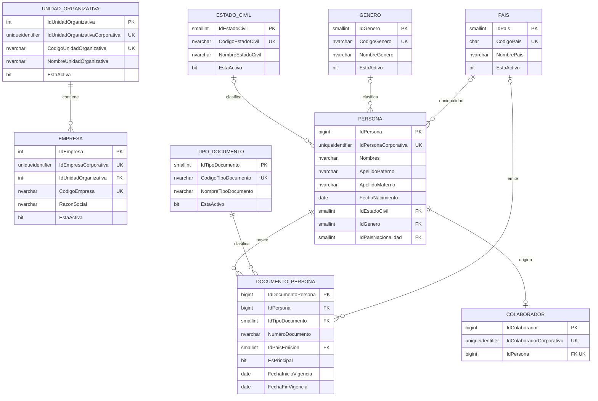
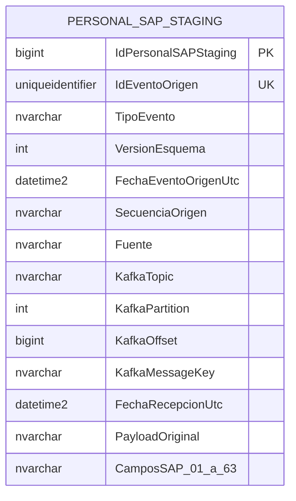
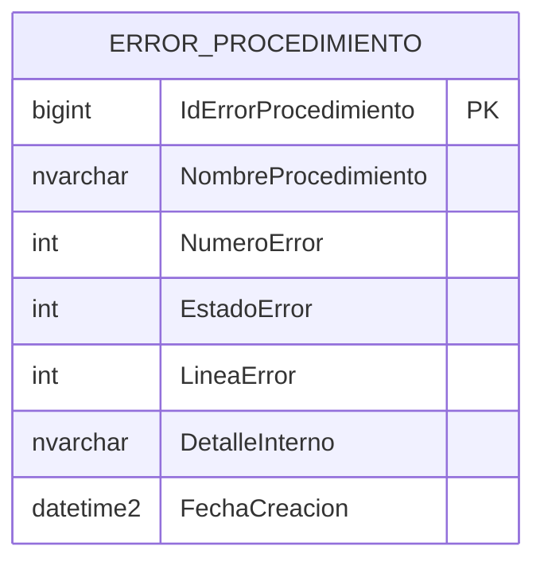
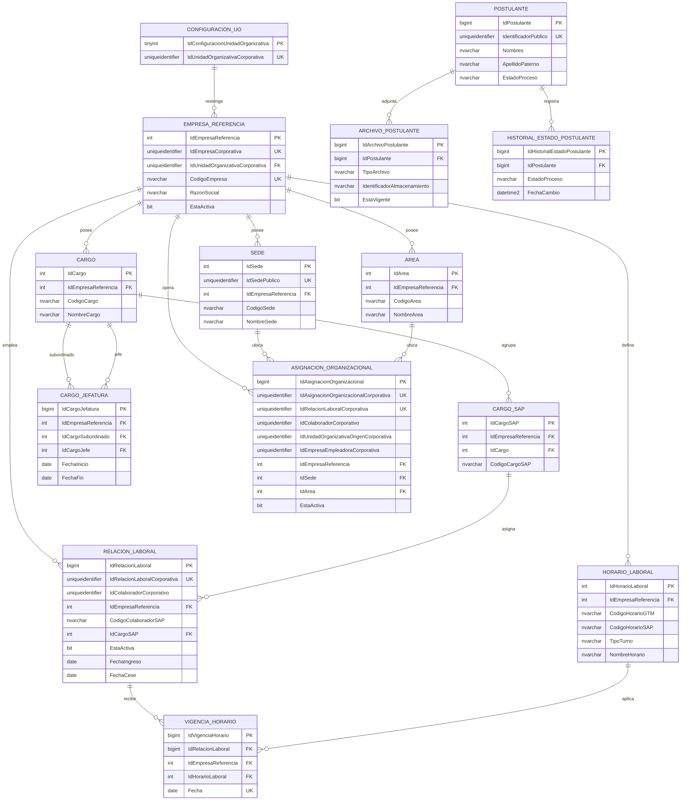
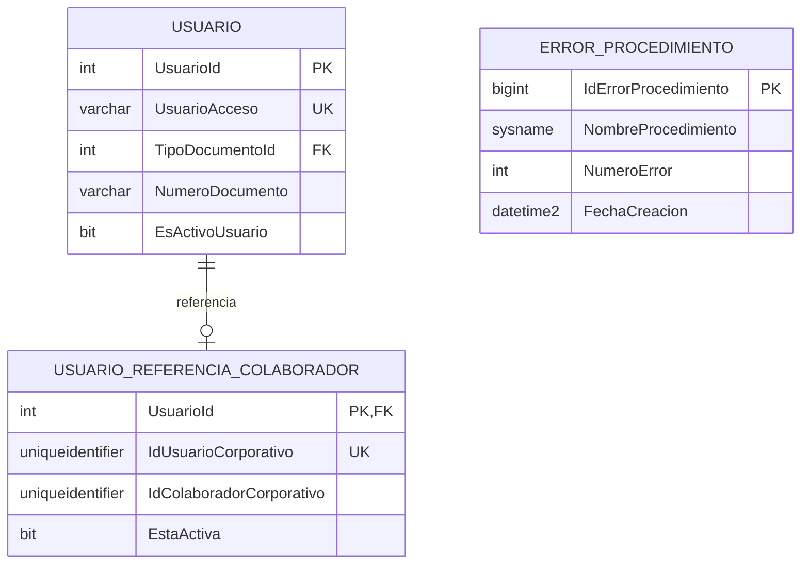

# Diagrama ER v1 — núcleo distribuido GTM

Fecha: 2026-09-24
Estado: consolidado contra las migraciones del núcleo
Motor objetivo: Microsoft SQL Server 2017

## Convenciones

- Las relaciones dibujadas dentro de un mismo diagrama son relaciones físicas
  candidatas a FK, salvo nota expresa.
- Los vínculos entre CO y una hija, o entre dos hijas, son lógicos mediante
  GUID y no generan FK distribuida.
- Una instancia hija representa una UO y puede contener varias empresas.
- Los atributos muestran identidad y relaciones principales; las columnas de
  auditoría y presentación pueden omitirse para mantener legibilidad.

## Instancia corporativa CO



## Integración SAP en CO



`integracion.TVP_RecepcionPersonalSAP` reproduce los metadatos y las 63
columnas de staging para lotes estructurados. El procedimiento
`integracion.usp_RegistrarPersonalSAPStaging` registra el lote de manera
idempotente; el payload es evidencia y no se vuelve a mapear con `OPENJSON`.

Restricciones implementadas:

- `UNIQUE (IdEventoOrigen)`.
- `UNIQUE (KafkaTopic, KafkaPartition, KafkaOffset)`.
- La tabla es append-only; no tiene FK hacia las tablas maestras.
- El TVP admite una o varias filas y el procedure descarta repeticiones por
  cualquiera de las dos identidades de evento.

## Auditoría interna de CO



`auditoria.ErrorProcedimiento` es una bitácora técnica local de CO. La escribe
`auditoria.usp_RegistrarErrorProcedimiento` cuando un procedure API encuentra un
error inesperado; no representa una entidad de negocio ni se expone al cliente.

Los 63 campos se normalizan como columnas SQL `NVARCHAR` anulables:

| # | Columna SQL propuesta | Encabezado de origen |
|---:|---|---|
| 1 | `Sociedad` | Sociedad |
| 2 | `Codigo` | Codigo |
| 3 | `TipoDocumentoIdentidad` | Tipo Documento Identidad |
| 4 | `NumeroDocumentoIdentidad` | Nº Documento Identidad |
| 5 | `ApellidoPaterno` | Apellido Paterno |
| 6 | `ApellidoMaterno` | Apellido Materno |
| 7 | `ApellidoSoltero` | Apellido Solter@ |
| 8 | `Nombres` | Nombres |
| 9 | `FechaIngreso` | Fecha de Ingreso |
| 10 | `FechaCese` | Fecha de Cese |
| 11 | `MotivoCese` | Motivo Cese |
| 12 | `PosicionCargo` | Posicion (cargo) |
| 13 | `DescripcionPosicion` | Descripcion Posicion |
| 14 | `LugarNacimiento` | Lugar Nacimiento |
| 15 | `FechaNacimiento` | Fecha Nacimiento |
| 16 | `Profesion` | Profesion |
| 17 | `CodigoArea` | Codigo Area |
| 18 | `DescripcionArea` | Descripcion Area |
| 19 | `CodigoJefe` | Codigo Jefe |
| 20 | `CodigoEvaluador` | Codigo Evaluador |
| 21 | `FechaFinContrato` | Fecha Fin de Contrato |
| 22 | `CodigoFotocheck` | Codigo Fotocheck |
| 23 | `CorreoElectronico` | Correo Electronico |
| 24 | `Evento` | Evento |
| 25 | `CodigoVia` | Codigo Via |
| 26 | `Calle` | Calle |
| 27 | `CalleYNumero` | Calle y Nro |
| 28 | `Numero` | Nro |
| 29 | `Interior` | Interior |
| 30 | `DepartamentoDireccion` | Dpto |
| 31 | `Manzana` | Manzana |
| 32 | `Lote` | Lote |
| 33 | `Kilometro` | Kilometro |
| 34 | `Bloque` | Bloque |
| 35 | `Etapa` | Etapa |
| 36 | `CodigoZona` | Codigo Zona |
| 37 | `NombreZona` | Nombre Zona |
| 38 | `Departamento` | Departamento |
| 39 | `Provincia` | Provincia |
| 40 | `Distrito` | Distrito |
| 41 | `TelefonoFijo` | Telefono Fijo |
| 42 | `TelefonoCelular` | Telefono Celular |
| 43 | `TelefonoReferencia` | Telefono Referencia |
| 44 | `GrupoPersonal` | Grupo Personal |
| 45 | `DescripcionGrupoPersonal` | Descripcion Grupo Personal |
| 46 | `CodigoAreaPersonal` | Codigo Area Personal |
| 47 | `DescripcionAreaPersonal` | Descripcion Area Personal |
| 48 | `CodigoSubdivision` | Codigo SubDivision |
| 49 | `DescripcionSubdivision` | Descripcion SubDivision |
| 50 | `CodigoDivisionPersonal` | Codigo Division Personal |
| 51 | `DescripcionDivisionPersonal` | Descripcion Division Personal |
| 52 | `CodigoCentroCosto` | Codigo Centro Costo |
| 53 | `DescripcionCentroCosto` | Descripcion Centro Costo |
| 54 | `Ubigeo` | Ubigeo |
| 55 | `Pais` | Pais |
| 56 | `Nacionalidad` | Nacionalidad |
| 57 | `CodigoEstadoCivil` | Codigo Estado civil |
| 58 | `DescripcionEstadoCivil` | Descripcion Estado Civil |
| 59 | `CampoAdicionalDireccion` | Campo Adicional de Direccion |
| 60 | `Tratamiento` | Tratamiento |
| 61 | `CuentaBancaria` | Cuenta Bancaria |
| 62 | `DestinoUtilizacion` | Dest. Utilización |
| 63 | `ClaveBanco` | Clave banco |

## Instancia hija de UO



## Vínculos lógicos distribuidos

```text
CO.UnidadOrganizativa.IdUnidadOrganizativaCorporativa
    └── Hija.ConfiguracionUnidadOrganizativa.IdUnidadOrganizativaCorporativa

CO.Empresa.IdEmpresaCorporativa
    └── Hija.EmpresaReferencia.IdEmpresaCorporativa
    └── Hija.AsignacionOrganizacional.IdEmpresaEmpleadoraCorporativa

CO.Colaborador.IdColaboradorCorporativo
    └── Hija.RelacionLaboral.IdColaboradorCorporativo
    └── Hija.AsignacionOrganizacional.IdColaboradorCorporativo

Hija origen.RelacionLaboral.IdRelacionLaboralCorporativa
    └── Hija donde opera.AsignacionOrganizacional.IdRelacionLaboralCorporativa
```

`AsignacionOrganizacional` no debe tener FK a una `RelacionLaboral` local porque
puede representar una relación procedente de otra instancia hija. Sí debe tener
FK local directa a `EmpresaReferencia`, y FKs compuestas que garanticen que sede
y área pertenecen a esa misma empresa.

## USERMANAGEMENTCORP: referencia al núcleo

Esta extensión se agrega a la base existente `USERMANAGEMENTCORP`; sus tablas
de usuario, rol, permiso, sistema y local no cambian. La entidad de dominio
nueva se ubica en `dbo` y tiene FK únicamente hacia `dbo.Usuario`; la tabla de
auditoría solo sirve al `CATCH` del procedure nuevo.



Restricciones previstas:

- `UsuarioReferenciaColaborador.UsuarioId` tiene a lo sumo una fila de referencia y
  `IdUsuarioCorporativo` es único.
- La unicidad de un `IdColaboradorCorporativo` se exige para referencias
  vigentes, permitiendo cuentas sin colaborador mediante valor `NULL`.
- No existe en UMC una tabla, auditoría o procedure para Microsoft Entra ID.
- `dbo.usp_ResolverContextoUsuarioNucleoPorAcceso` consulta el usuario legacy
  por `UsuarioAcceso` exacto o `UsuarioId` y su referencia, sin crear
  equivalencias de identidad externa.
- `auditoria.ErrorProcedimiento` es una bitácora local usada solo por el
  `CATCH` de ese procedure nuevo; ningún procedure legacy la invoca.

Límite de identidad y responsabilidades:

```text
Proveedor de identidad externo
    └── backend valida y obtiene UsuarioAcceso o UsuarioId fuera de UMC
    └── UMC.dbo.usp_ResolverContextoUsuarioNucleoPorAcceso
    └── UMC.dbo.Usuario / tablas legacy de roles y permisos
    └── UMC.dbo.UsuarioReferenciaColaborador
    └── CO.rrhh.Colaborador.IdColaboradorCorporativo (vínculo lógico)
```

El backend valida que el GUID de colaborador exista en CO antes de administrar
la referencia. La conciliación inicial entre `dbo.Usuario` y CO usa documento
de identidad con equivalencia controlada del tipo documental; no usa correo,
nombre ni código SAP como clave. UMC no recibe ni persiste datos de identidad
externa, tokens o correo, ni inventa un mapeo hacia `UsuarioAcceso`.

## Cardinalidades e invariantes principales

- Una UO CO contiene muchas empresas.
- Una instancia hija representa exactamente una UO y proyecta muchas empresas.
- Una persona tiene cero o un colaborador y muchos documentos.
- Un colaborador puede tener una relación por cada empresa; la relación se
  reactiva en un reingreso a la misma empresa.
- Una relación activa que opera tiene exactamente una asignación activa en el
  conjunto de hijas, almacenada solo donde opera.
- Una empresa local contiene muchas sedes, áreas, cargos y horarios.
- Una relación tiene como máximo una vigencia de horario por fecha.
- Cada evento Kafka produce como máximo una fila de staging por identidad de
  evento y por posición Kafka.

## Límites conscientes de v1

- Una base hija puede impedir duplicados locales de asignación, pero no imponer
  una restricción única sobre todas las demás hijas. La coordinación global es
  responsabilidad de la operación backend que crea o mueve la asignación.
- La versión aprobada reactiva la relación colaborador–empresa y no conserva
  historial de reingresos.
- La versión actual no conserva historial de asignaciones organizacionales.
- No se define aún el proceso de promoción de staging hacia el núcleo.
- No se inventan estados de procesamiento de staging ni restricciones
  adicionales de datos sensibles en esta fase.
- El núcleo UO no es desplegable junto con las migraciones vigentes de
  Alimentación: estas aún referencian `rrhh.Colaborador`. La migración
  coordinada de Alimentación queda explícitamente para la fase posterior a la
  aprobación del núcleo.
